# LiDAR Point Cloud Semantic Segmentation

Semantic segmentation of outdoor urban LiDAR point clouds on Paris-Lille-3D, with a focus on geometric feature ablations, class imbalance, and spatial error analysis.

## Project framing

This project studies how a deep model learns semantic structure from irregular 3D point clouds, where geometry is sparse, unordered, and highly imbalanced across classes. Rather than treating the task as a pure benchmark exercise, the goal is to understand which signals actually drive performance on difficult classes such as pedestrians, bollards, trash cans, and pole-signs.

The project also demonstrates transfer from volumetric biomedical imaging to outdoor LiDAR segmentation. In both cases, the core challenge is learning meaningful 3D representations from spatial data, but the LiDAR setting removes the regular voxel grid and introduces strong density variation, scale heterogeneity, and sensor-driven geometric noise.

## Research questions

- Do surface normals consistently improve semantic segmentation, or do they become unreliable on thin vertical structures?
- Are rare-class failures driven mainly by class imbalance, noisy local geometry, or limited spatial context?
- Which loss function best handles extreme class imbalance — and does focal loss help or hurt?
- How sensitive is the model to the radius used for normal estimation?
- How much context (block size, point count) is needed to recover rare classes?
- How do PointNet++, RandLA-Net, and PointTransformer compare under identical conditions?

## Dataset

Experiments use the Paris-Lille-3D benchmark, with three scans for training (`Lille1_1`, `Lille1_2`, `Lille2`) and one scan for validation (`Paris`). The semantic label space contains 10 classes including ground, building, pole-sign, bollard, trash can, barrier, pedestrian, car, and vegetation.

A key difficulty is severe class imbalance. Ground and building dominate the dataset, while pedestrian represents only about 0.1 percent of points, making global accuracy alone a misleading metric.

<p align="center">
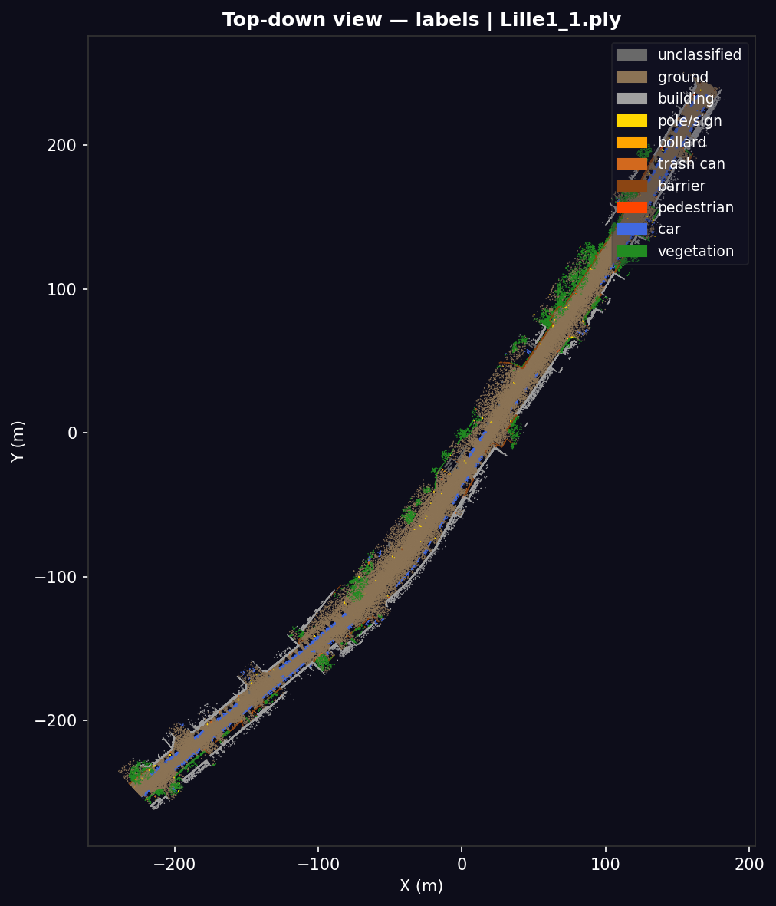
</p>
<p align="center"><em>Top-down view of the Lille1_1 training scan — ~3 million points after 5 cm voxel downsampling, annotated with 10 semantic classes.</em></p>

<p align="center">
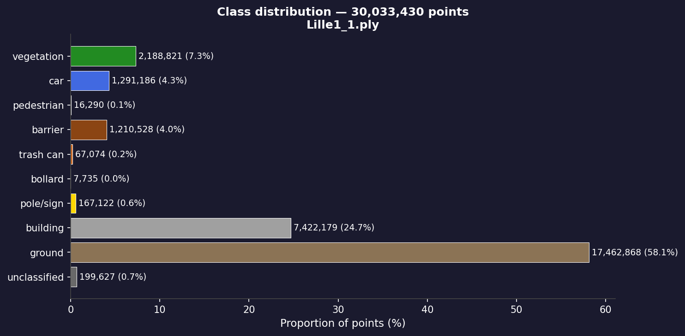
</p>
<p align="center"><em>Class distribution in the raw scan. Ground covers 58% of points; bollard 0.003% — 18,000× rarer. A model predicting only "ground" would reach 58% accuracy yet be useless for any urban mapping task.</em></p>

## Method

### Preprocessing

The preprocessing pipeline converts raw annotated PLY files into reusable NumPy tensors through voxel downsampling at 0.05 m, normal estimation, and feature assembly. Each point is represented by 8 input channels: normalized x and y within the block, block-local normalized z (height above local ground divided by half-block size), height above local ground in meters, reflectance, and the three components of the local surface normal. All three geometry channels share the same unit scale, which ensures unbiased KNN neighborhoods in architectures such as RandLA-Net and PointTransformer.

### Model

The main baseline is a PointNet++ SSG encoder-decoder with set abstraction and feature propagation layers, analogous in spirit to a 3D U-Net operating on irregular point sets instead of dense volumes. This model has 972,714 trainable parameters. Architecture comparison with RandLA-Net (1,595,786 params) and PointTransformer was conducted in Exp 4.

### Training

Training uses weighted cross-entropy to address extreme class imbalance, Adam optimization, cosine annealing, geometric augmentation, gradient clipping, automatic mixed precision (AMP), TensorBoard logging, checkpointing, and early stopping on validation mIoU. The class-weight computation is explicitly designed to prevent collapse toward dominant classes such as ground and building.

<p align="center">
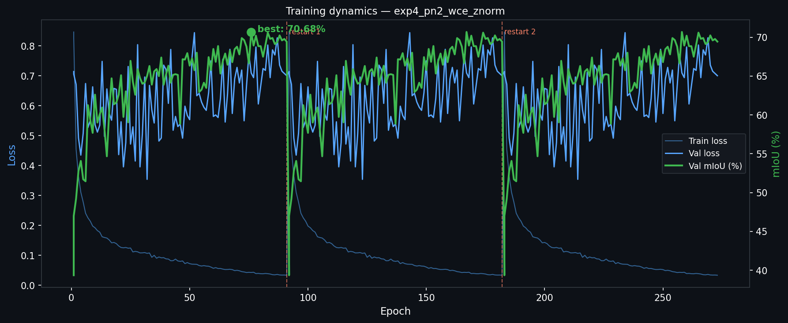
</p>
<p align="center"><em>Training dynamics for exp4_pn2_wce_znorm. Dashed red lines mark checkpoint resumes after hardware interruptions (PSU crashes). Weighted cross-entropy maintains stable convergence throughout; best val mIoU reached 70.68%.</em></p>

### Inference

Inference is performed with sliding 4 m × 4 m windows using a 2 m stride over the full scene, followed by aggregation of multiple local predictions for each point through majority voting. This mirrors the same tiling logic often used in volumetric medical segmentation, adapted here to irregular LiDAR geometry.

## Results

All experiments use 4096 points per block (unless noted), `block_size=4.0 m`, `seed=42`.

> **Note on exp4:** starting from Exp 4, feature channel 2 stores `z_norm = height / half` instead of raw Lambert-93 Z. PointNet++ uses channels [0, 1, 3] for geometry (unaffected by the KNN bias), but all model weights expect the new channel 2 distribution, so exp 1–3 checkpoints are not reused. Exp 1–3 ablation results remain valid on their own terms.

---

### Overall best

```text
Architecture  : PointTransformer (exp4_pt_wce_znorm)
mIoU          : 73.37%   (+2.69 over PointNet++ SSG)
OA            : 96.89%
Pedestrian    : 57.10%
Bollard       : 47.43%
Pole/sign     : 72.98%
Trash can     : 18.83%
Parameters    : 3,071,818
```

| Ground truth — Paris (held-out) | Predictions — PointTransformer |
| :---: | :---: |
| 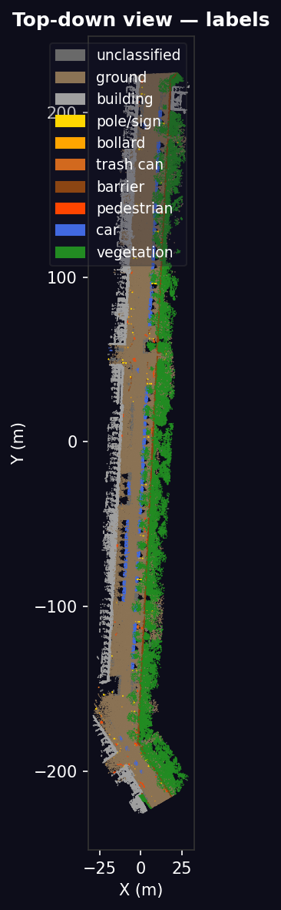 | 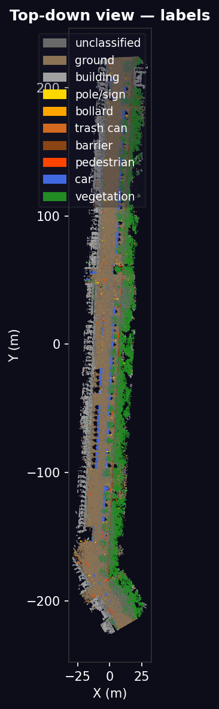 |

*Sliding-window inference over the full Paris validation scan (15 M points). Each point accumulates votes from all overlapping 4 m × 4 m blocks; final label = majority vote.*

---

### Architecture benchmark (Exp 4)

*Same protocol for all: `weighted_ce`, `normal_radius=0.3`, `block_size=4.0 m`, `N=4096`, `z_norm` geometry.*

| Architecture | mIoU | OA | Params | Train time | Pedestrian | Bollard | Pole/sign | Trash can |
| --- | ---: | ---: | ---: | ---: | ---: | ---: | ---: | ---: |
| **PointTransformer** | **73.37** | **96.89** | 3,071,818 | 22.4 h | 57.10 | **47.43** | **72.98** | 18.83 |
| PointNet++ SSG | 70.68 | 96.53 | **972,714** | 24.7 h | **59.19** | 35.92 | 62.61 | **24.73** |
| RandLA-Net | 66.04 | 94.68 | 1,595,786 | 43.8 h | 48.95 | 32.22 | 51.11 | 19.07 |

PointTransformer leads overall (+2.7 pp mIoU over PointNet++) with notable gains on bollard (+11.5 pp) and pole/sign (+10.4 pp) — classes that benefit from local vector self-attention on sparse geometric structures. PointNet++ retains an edge on pedestrian (+2.1 pp) and trash can (+5.9 pp), where compact rare-object detection favours the global set-abstraction hierarchy. RandLA-Net trails on all metrics despite the largest parameter count, confirming that random sampling is poorly suited to this severely imbalanced dataset.

<p align="center">
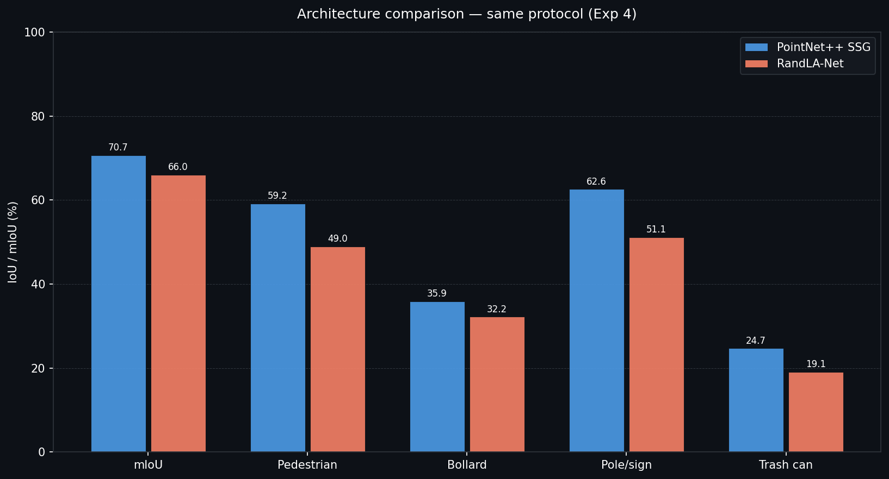
</p>
<p align="center"><em>Three-way architecture comparison under identical training protocol. PointTransformer (green) leads on mIoU and thin-structure classes; PointNet++ (blue) holds on compact rare objects; RandLA-Net (orange) trails throughout.</em></p>

---

### All runs

| Experiment | Architecture | Loss | Normal radius | mIoU | OA | Pedestrian | Bollard | Pole/sign | Trash can |
| --- | --- | --- | ---: | ---: | ---: | ---: | ---: | ---: | ---: |
| exp1_r010 | PointNet++ | weighted_ce | 0.1 | 59.28 | 90.69 | 48.97 | 19.21 | 46.94 | 16.96 |
| exp1_r020 | PointNet++ | weighted_ce | 0.2 | 69.13 | 95.11 | 49.63 | **41.96** | 58.34 | **28.12** |
| exp1_r030 | PointNet++ | weighted_ce | 0.3 | 63.35 | 93.75 | 53.12 | 31.91 | 44.88 | 13.41 |
| exp1_r050 | PointNet++ | weighted_ce | 0.5 | 68.53 | 95.65 | 49.06 | 35.94 | 57.16 | 25.29 |
| exp2_ce | PointNet++ | ce | 0.3 | 68.31 | 96.14 | 54.46 | 33.49 | 58.55 | 24.08 |
| exp2_weighted_ce | PointNet++ | weighted_ce | 0.3 | 69.51 | 96.49 | 54.73 | 32.31 | 60.10 | 22.87 |
| exp2_focal | PointNet++ | focal | 0.3 | 1.42 | 0.74 | 9.02 | 2.69 | 0.39 | 0.66 |
| exp2_focal_v2 | PointNet++ | focal | 0.3 | 50.10 | 83.22 | 43.39 | 27.63 | 23.09 | 4.53 |
| exp2_cb_focal | PointNet++ | cb_focal | 0.3 | 2.49 | 0.69 | 7.75 | 14.01 | 0.54 | 0.09 |
| exp2_cb_focal_v2 | PointNet++ | cb_focal | 0.3 | 57.07 | 89.11 | 41.44 | 37.53 | 35.91 | 7.45 |
| exp3_b2_n2048 | PointNet++ | weighted_ce | 0.3 | 67.09 | 94.79 | 54.34 | 35.03 | **66.68** | 9.94 |
| exp4_pn2_wce_znorm | PointNet++ | weighted_ce | 0.3 | 70.68 | 96.53 | 59.19 | 35.92 | 62.61 | 24.73 |
| exp4_randlanet_wce_znorm | RandLA-Net | weighted_ce | 0.3 | 66.04 | 94.68 | 48.95 | 32.22 | 51.11 | 19.07 |
| **exp4_pt_wce_znorm** | **PointTransformer** | **weighted_ce** | **0.3** | **73.37** | **96.89** | 57.10 | **47.43** | **72.98** | 18.83 |

---

### Ablation study

#### Effect of loss function (PointNet++, normal radius = 0.3, block = 4 m, N = 4096)

| Loss | mIoU | OA | Notes |
| --- | ---: | ---: | --- |
| weighted_ce | **69.51** | **96.49** | Best overall, stable training |
| ce | 68.31 | 96.14 | Only −1.2% mIoU vs weighted, but weaker on rare classes |
| focal | 1.42 | 0.74 | Complete collapse — learning failure |
| focal_v2 | 50.10 | 83.22 | Unstable, strong degradation on rare classes |
| cb_focal | 2.49 | 0.69 | Complete collapse — learning failure |
| cb_focal_v2 | 57.07 | 89.11 | Second attempt improves, but still −12% mIoU |

`weighted_ce` is the most robust loss for this imbalanced setup. Both focal variants fully collapsed on the first attempt and recovered partially after tuning (`_v2`), but remain significantly below `weighted_ce`. The high OA paired with near-zero mIoU in collapsed runs confirms the model predicted only dominant classes (ground, building).

#### Effect of normal estimation radius (PointNet++, loss = weighted_ce, block = 4 m, N = 4096)

| Normal radius | mIoU | OA | Bollard | Trash can | Pole/sign |
| ---: | ---: | ---: | ---: | ---: | ---: |
| 0.1 m | 59.28 | 90.69 | 19.21 | 16.96 | 46.94 |
| 0.2 m | **69.13** | 95.11 | **41.96** | **28.12** | 58.34 |
| 0.3 m | 69.51 | **96.49** | 32.31 | 22.87 | 60.10 |
| 0.5 m | 68.53 | 95.65 | 35.94 | 25.29 | 57.16 |

The optimal radius lies between 0.2 and 0.3 m. At r=0.1 m, normals are noisy and the model degrades sharply, especially on bollards (−22% vs r=0.2). At r=0.5 m, overly smooth normals lose discriminative power on small objects. r=0.2 produces the best result on rare classes while r=0.3 gives slightly better overall OA.

#### Effect of block size and point count (PointNet++, loss = weighted_ce, normal radius = 0.3)

| Experiment | Block size | N points | mIoU | OA | Pole/sign | Trash can |
| --- | ---: | ---: | ---: | ---: | ---: | ---: |
| exp2_weighted_ce | 4.0 m | 4096 | **69.51** | **96.49** | 60.10 | **22.87** |
| exp3_b2_n2048 | 2.0 m | 2048 | 67.09 | 94.79 | **66.68** | 9.94 |

Halving block size and point count reduces global mIoU by only 2.4%, but dramatically shifts the per-class distribution: pole/sign improves (+6.6%) while trash can drops sharply (−12.9%). Smaller blocks provide finer local context, which benefits thin elongated structures, but reduce spatial coverage for rare compact objects.

---

### Interpretation

- **PointTransformer is the best architecture for this setup.** Local vector self-attention consistently outperforms set-abstraction (PointNet++) and random sampling (RandLA-Net), especially on thin and sparse structures (bollard +11.5 pp, pole/sign +10.4 pp over PointNet++). PointNet++ retains an edge on compact rare objects (pedestrian, trash can) where global hierarchical context matters more than local attention.
- **`weighted_ce` is the most reliable loss.** Focal loss variants failed or underperformed significantly, even after hyperparameter tuning. The imbalance here is too severe for focal loss without careful gamma and alpha tuning.
- **Normal radius r=0.2–0.3 m is the optimal range.** Too small is noisy; too large is oversmoothed. The sweet spot depends on the target class: r=0.2 best serves small objects, r=0.3 gives better global OA.
- **Block geometry is a trade-off, not a free parameter.** Smaller blocks help thin structures (pole/sign) at the cost of compact rare objects (trash can). This suggests that multi-scale inference or class-specific block strategies could further close the gap.
- **Global OA is not a reliable indicator of rare-class performance.** Collapsed runs (focal, cb_focal) achieved <1% mIoU while showing 0.7–0.8% OA — confirming that the model learned to predict only dominant classes.

## Per-class interpretation

| Class | Best IoU | Best run | Notes |
| --- | ---: | --- | --- |
| Ground | 97.0 | exp2_weighted_ce | Dominant and geometrically easy |
| Building | 87.4 | exp2_weighted_ce | Strong planar structure |
| Vegetation | 87.6 | exp2_weighted_ce | Distinctive local geometry |
| Car | 94.5 | exp2_weighted_ce | Compact regular object |
| Barrier | 56.0 | exp2_weighted_ce | Boundary confusion with ground |
| Pedestrian | **59.19** | exp4_pn2_wce_znorm | Rare and small; global hierarchy of PointNet++ edges out attention |
| Bollard | **47.43** | exp4_pt_wce_znorm | Extremely scarce; local vector attention recovers +11.5 pp over PointNet++ |
| Pole-sign | **72.98** | exp4_pt_wce_znorm | Thin structures; attention on sparse geometry outperforms all other methods |
| Trash can | **24.73** | exp4_pn2_wce_znorm | Rarest and hardest class; compact shape favours global abstraction |

These results show that average mIoU hides several distinct regimes: easy large planar classes, medium-sized regular objects, and rare thin or compact classes where local representation quality matters far more than raw capacity.

## Error analysis

The repository includes a dedicated post-hoc analysis script that generates a recall-normalized confusion matrix, a top-down error map, the most frequent confusion pairs, and zoomed inspections of hard classes. This moves beyond a scoreboard mindset and turns the model into an analyzable system.

<p align="center">
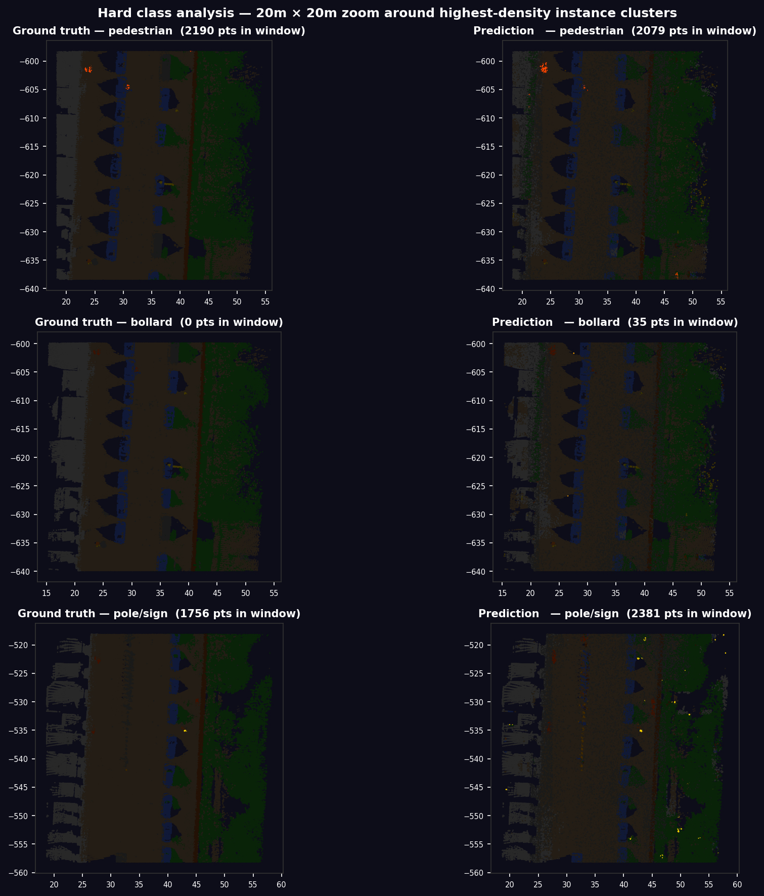
</p>
<p align="center"><em>20 m × 20 m zoom around the hardest classes (left: ground truth, right: predictions). Pedestrian clusters are largely recovered; bollard detection is partial in high-density areas; pole/sign benefits from spatial proximity to the scan trajectory.</em></p>

| Confusion matrix (recall per class) | Top confusion pairs |
| :---: | :---: |
| 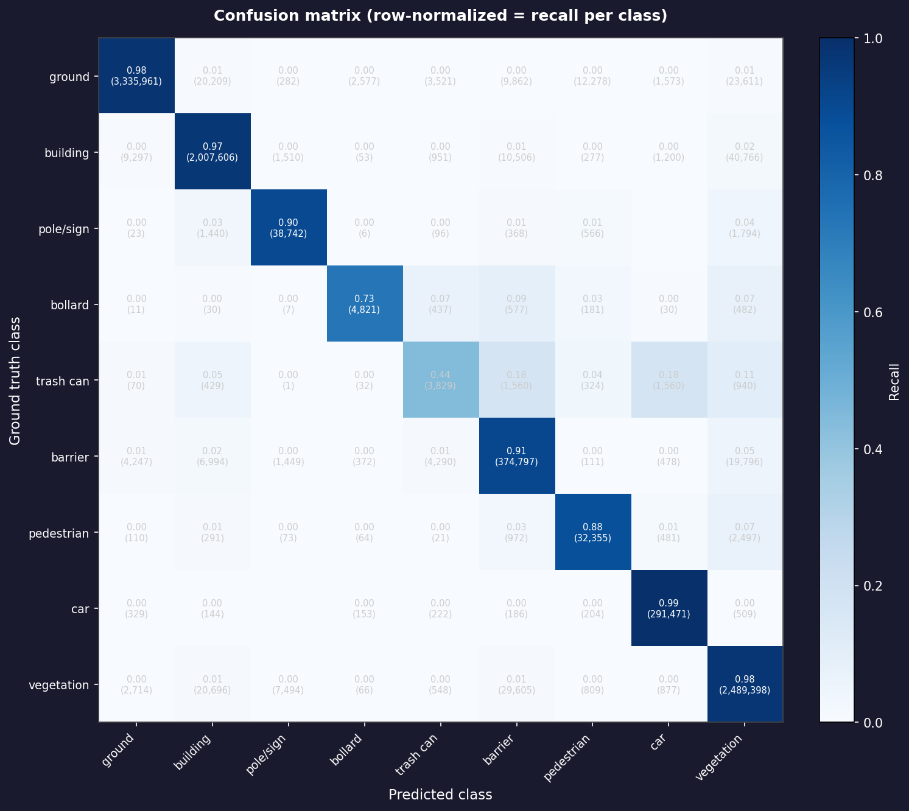 | 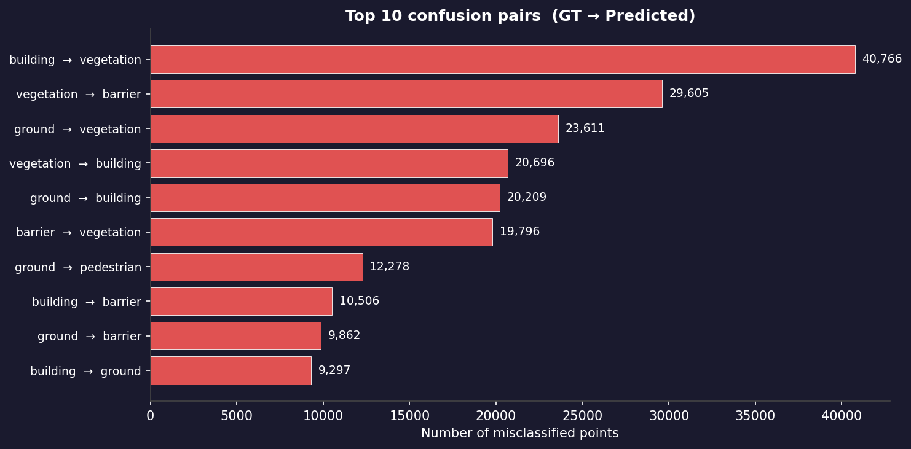 |

*Left: recall-normalized confusion matrix — diagonal shows per-class recall; off-diagonal reveals systematic confusions. Right: the 10 most frequent misclassification pairs by point count. Building↔vegetation dominates, driven by boundary ambiguity between façades and overhanging trees.*

The error-analysis tooling shows that failures concentrate around hard classes, class boundaries, and rare object regions rather than being uniformly distributed in space.

## Exp 5 — Predictive uncertainty

Inference stores per-point averaged softmax probabilities across overlapping windows (`--save_probs`). Predictive entropy `H(x) = -∑ p_c log p_c`, normalized to [0, 1], measures how much the model disagrees with itself on each point.

<p align="center">
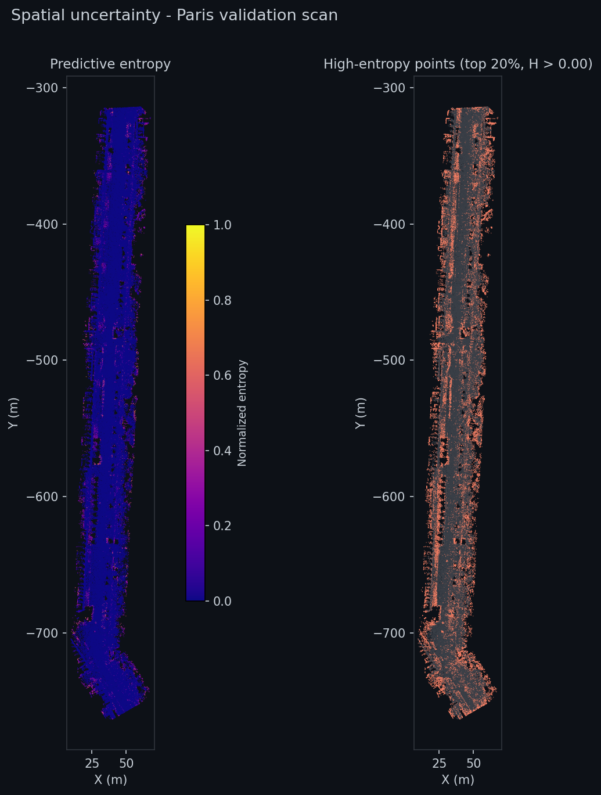
</p>
<p align="center"><em>Left: entropy map of the Paris validation scan. Right: high-entropy points (top 20%, red) overlaid on the scene. Uncertainty concentrates at building-vegetation boundaries, scan edges, and rare object locations — not randomly distributed.</em></p>

| Entropy per GT class | Correct vs incorrect predictions |
| :---: | :---: |
| 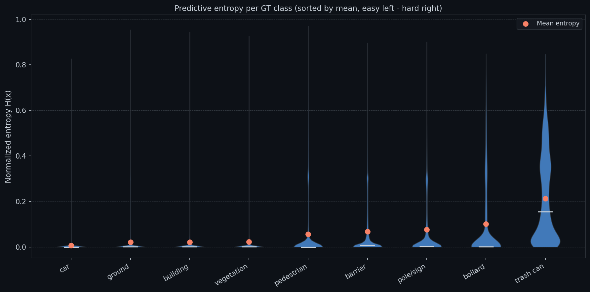 | 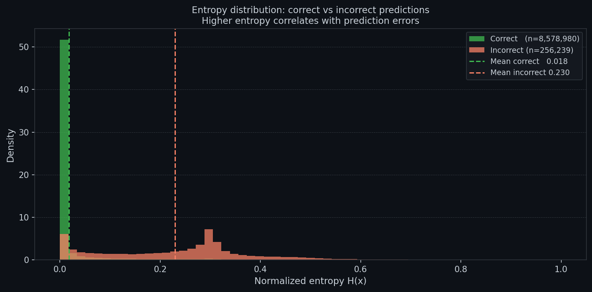 |

*Left: violin plot of entropy per GT class, sorted by mean. Ground and car are very certain (low entropy); bollard and trash can are intrinsically ambiguous. Right: the model is well-calibrated — misclassified points have systematically higher entropy than correct predictions. The mean entropy gap between the two groups is visible in both tails.*

<p align="center">
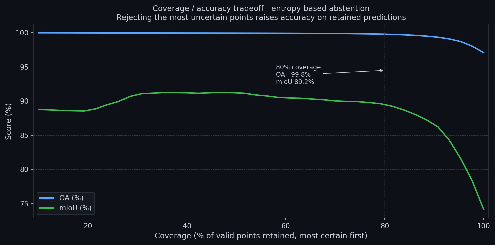
</p>
<p align="center"><em>Coverage/accuracy tradeoff using entropy-based abstention. Retaining the 80% most certain points raises OA from 97.1% to 99.8% (+2.7 pp) and mIoU from 74.1% to 89.2% (+15.1 pp). Flagging the remaining 20% for human review dramatically reduces the labeling burden in a mobile-mapping workflow without discarding most of the scene.</em></p>

## Limitations & open questions

- The 4 m block formulation is a likely bottleneck for context-dependent distinctions. Some classes may benefit from larger blocks (more global context) while others suffer from majority-vote fusion across overlapping windows. A multi-scale inference strategy could partially close the gap on trash can and bollard.
- ~40% of labeled points receive no sliding-window vote (points at scan boundaries or in sparse regions). These are assigned `pred=0` and excluded from the scored set. A denser stride (1 m vs 2 m) would increase coverage at the cost of ~4× longer inference.
- PointTransformer training used `torch_cluster.fps` (CUDA-native FPS) for a fair comparison. The iterative fallback implementation would have been ~10× slower and unrepresentative of production throughput.

## Repository structure

- `preprocess.py` — preprocessing and feature generation.
- `train.py` — training entry point with selectable architectures (PointNet++ SSG, RandLA-Net, PointTransformer).
- `train_ablation.py` — ablation runner for feature and training recipe studies.
- `inference.py` — sliding-window scene inference.
- `error_analysis.py` — confusion and spatial failure analysis.
- `trainer.py` — optimization loop, weighting, early stopping, and logging.
- `src/fusion/projection.py` — camera-LiDAR geometry utilities (projection, colorization, calibration sensitivity).
- `scripts/colorize_pointcloud.py` — CLI for point cloud colorization from RGB image.
- `scripts/eval_projection.py` — CLI for calibration sensitivity analysis.
- `scripts/plot_training_curves.py` — training dynamics visualization from TensorBoard logs (loss + mIoU, restart annotations).
- `scripts/plot_architecture_comparison.py` — grouped bar chart comparing architectures from `outputs/results.csv`.
- `scripts/uncertainty_analysis.py` — Exp 5: entropy maps, per-class uncertainty, and coverage/accuracy tradeoff from saved softmax probabilities.

## Usage

End-to-end pipeline from a raw annotated PLY scan to a labeled LAS file.

```bash
# Step 1 — preprocess raw PLY scan (voxel downsample, normals, feature assembly)
python preprocess.py --scan MyScan

# Step 2 — inference: saves predictions, averaged softmax probs, and labeled LAS
python scripts/inference.py --scan MyScan \
    --model point_transformer \
    --checkpoint outputs/checkpoints/exp4_pt_wce_znorm/best.pth \
    --save_probs --save_las

# Step 3 — uncertainty QA: flag the 20% most uncertain points for human review
python scripts/uncertainty_analysis.py --scan MyScan
```

### Outputs

- `outputs/predictions/MyScan_predictions.las` — LAS 1.4 with predicted class indices in the `classification` field (0–9). Compatible with CloudCompare, LAStools, and YellowScan Explorer.
- `outputs/figures/uncertainty/coverage_accuracy.png` — shows the OA / mIoU gain from rejecting uncertain predictions. At 80% coverage, OA rises to 99.8% and mIoU to 89.2%.

## Takeaway

This project is best presented as a 3D representation-learning study on irregular geometry, not only as a segmentation benchmark. Its main strength is the combination of engineering completeness and hypothesis-driven analysis around normals, class imbalance, loss sensitivity, architecture comparison, spatial failure modes, and predictive uncertainty — turning the model into an analyzable, production-oriented system rather than a pure benchmark entry.
